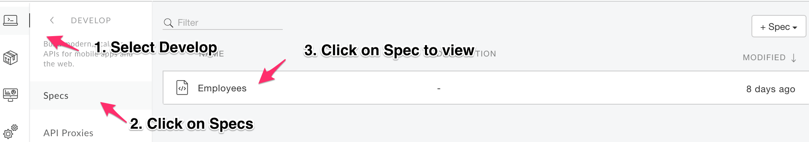
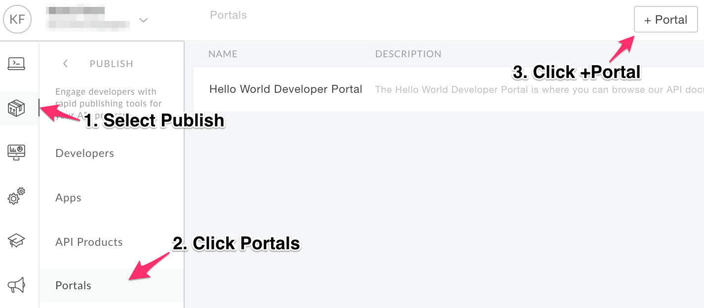
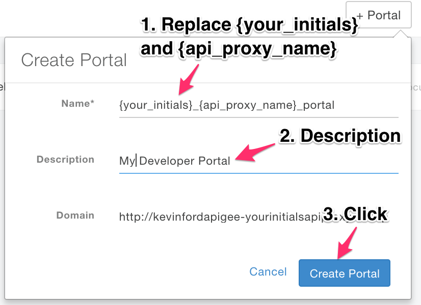

# Publishing APIs : Publish documentation

*Duration : 15 mins*

*Persona : API Team*

# Use case

You have an API Proxy that you would like to share with App Developers.  You want to enable developers to learn about, register for, and begin using your API Proxy.

# How can Apigee Edge help?

Apigee Edge provides multiple options for your Developer Portal.  There is a lightweight portal that supports branding and customization of much of the site, such as theme, logos, and page content.  The lightweight portal can be published in seconds, directly from the management UI.  We also provide a Drupal-based portal if you want full control and to leverage any of the hundreds of Drupal modules available in the Drupal Market.  This lab focuses on the lightweight Apigee Developer Portal.

In this lab, you will create a Developer Portal and publish an OpenAPI specification that can be used by developers.

# Pre-requisites

For this lab, you will need…

* An OpenAPI specification uploaded to your Organization.  This specification will make up the documentation of your API Proxy.  If you do not have an OpenAPI Specification available for this lab, revisit the lab *API Design : Create a Reverse Proxy with OpenAPI Specification* and then return here to complete these steps.

# Instructions

## Review your OpenAPI Specification

* Go to [https://apigee.com/edge](https://apigee.com/edge) and log in. This is the Edge management UI
* Select **Develop → Specs**
* Review the OpenAPI Specification in the editor.  If you don't have one, revisit the lab "API Design : Create a Reverse Proxy with OpenAPI Specification"

## Create an API Product to expose your APIs on the Developer Portal

* Navigate to "Publish \ API Products" and click "+API Product"

* Populate and Save the API Product with the following values
  * Name: {your_initials}-employees-free
  * Display Name: {your_initials} Employees (Free Trial)
  * Environment: Test
  * Access: Public
  * Quota: 5 requests every 1 minute
  * Under Resources\API Proxies, click "+API Proxy" button and select your Employees proxy
  * Save

## Publish a new Portal on Apigee Edge

* Select **Publish → Portals → +Portal**

* Enter details in the portal creation wizard. Replace **{your-initials}** with the initials of your name and replace **{api_proxy_name}** with the name of the proxy.

  * Name: **{your_initials}**_**{api_proxy_name}**_portal

  * Description: Enter a brief description

* Click **Create Portal**

## Publish an API Product to the Portal

### 1) Select your API Product
* Click the Portal Editor’s dropdown and select **APIs** from the list of sections.
* Click "+API"
* Select your API Product from the list

### 2) Create a Snapshot of an OpenAPI Specification and save
* Click "Add Spec Snapshot"
* Click the radio button to select from the pulldown
* Click "Choose a different spec..."
* Find your Spec, Click "Review"
* Click "Save and Complete"

### 3) Browse your API Documentation in the Developer Portal

* The Developer Portal will now contain the OpenAPI Specification (FKA Swagger) for browsing the APIs included in the product. [OpenAPI Specification](https://github.com/OAI/OpenAPI-Specification/blob/master/versions/2.0.md).
  * Open the Developer Portal by clicking the "Live Portal" link
  * Click "APIs"
  * Select the API Product you published previously
  * Browse the documentation.  Sections can be collapsed or expanded by clicking on their headers.

## Create a Developer Account and App to use secured APIs
If the API requires credentials, you must create a developer account and register an App.

### Create an Account
  * Click Login, then "Sign up", and create an account.  You will receive an email, click the included link.

  
### Register an App and select an API Product
  * To create an App, complete the steps in the following video.  It's recommended that you copy the App's credentials (API Key and Client Secret) to a text file to save time later when trying to make authenticated API requests.

# Lab Video

If you would rather watch a video that covers this topic, point your browser [here](https://www.youtube.com/watch?v=_gDpzDJPNQg).

# Earn Extra-points

Try your hand at managing OpenAPI Snapshots.  Modify your OpenAPI Spec and introduce the new changes to your portal, as a new Snapshot.

Add a second product to the portal and test it by launching the Live Portal.

# Quiz

1. What are two reasons why you might publish multiple API Products to the Developer Portal?

2. Changes made to OpenAPI Specification are made available in the Developer Portal automatically.  True or False?

# Summary

You’ve learned how to do the following;

* Deploy the Apigee Lightweight Developer Portal

* Publish an API Product with an OpenAPI Specification

* Use the Developer Portal UI to browse the OpenApi Specification Snapshot as a developer.

# Rate this lab

How did you link this lab? Rate [here](https://goo.gl/forms/j33WG2U0NFf02QHi1).

