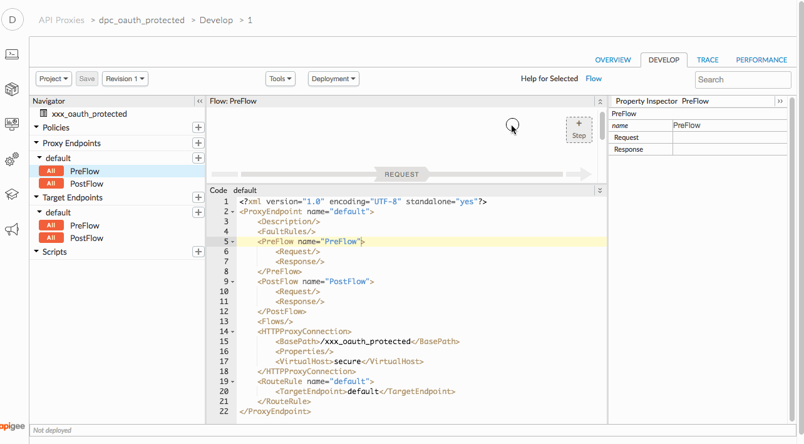

# API Security : Securing APIs with OAuth (2-legged) 

*Duration : 30 mins*

*Persona : API Team/Security*

# Use case

You have a set of APIs that are consumed by trusted partners. You want to secure those APIs using a two legged OAuth. 

# How can Apigee Edge help?

[The OAuth specification](https://tools.ietf.org/html/rfc6749) defines token endpoints, authorization endpoints, and refresh endpoints. Apps call these endpoints to get access tokens, to refresh access tokens, and, when using 3-legged OAuth, to kick off the authorization code flow.

Apigee Edge quickly lets you secure your APIs using out of the box OAuth policies. Apigee Edge OAuth policies 
can be used to implement the standard OAuth endpoints, and lets you easily secure your APIs using a simply policy to verify tokens.

# Background: What's a token?

An OAuth token is a digital analog of an old-school subway token: it's a "ticket to ride". The holder of an OAuth token (a client application) can present it to the token verifier (typically a gateway or a server application), and if the token is valid, then the token verifier will treat the request as valid. 

When you use Apigee Edge OAuth to protect your APIs, Apigee Edge acts as the token issuer and the token verifier. A 2-legged OAuth flow, also known as a client credentials grant type, looks like this: 


Most typically, the client_credentials grant type is used when the app is also the resource owner. For example, an app may need to access a backend cloud-based storage service to store and retrieve data that it uses to perform its work, rather than data specifically owned by the end user. Imagine a mobile app that allows customers to place orders. The client credentials might be used to protect data that is not customer specific - like a query on the product catalog, or even populating an anonymously-held "shopping cart". 

As the name indicates, a client-credentials grant will verify only the credentials of the client, or the app itself. A Client credentials grant does not verify user credentials. 

When using the Client credentials grant type, Apigee Edge is the OAuth authorization server. Its role is to generate access tokens, validate access tokens, and proxy authorized requests for protected resources on to the resource server. 

# Pre-requisites

* You have an OAuth API proxy in Apigee Edge. This API proxy is created by default when you provision an Edge Organization on Cloud. If this does not exist, let your instructor know.

* The Employees API Proxy.  If you do not have this proxy, revisit the lab *API Design : Create a Reverse Proxy with OpenAPI Specification*.

* You have the following created on Apigee Edge - an API Product, a Developer and an App. If not, jump back to *Publishing APIs : Publish documentation* lab.

# Instructions

1. Open the previously created Employees API Proxy and open the "Develop" tab.
1. Select **PreFlow** from the sidebar under **Proxy Endpoints** section.

   

1. Click on **+Step**

   

1. In the resulting dialog, scroll down select **OAuth v2.0** from the Security section then click the **Add** button.

   

1. Click on the policy and in the code editor, paste the code given below:

   ```
   <OAuthV2 name="OAuth-v20-1">
      <DisplayName>OAuth v2.0-1</DisplayName>
      <ExternalAuthorization>false</ExternalAuthorization>
      <Operation>VerifyAccessToken</Operation>
      <GenerateResponse enabled="true"/>
   </OAuthV2>
   ```

   It should look like this: 

   

2. Because we want Apigee to not pass the token to the backend API, let's remove the Authorization header. To do so, again click on **+Step**.

2. In the dialog, select **Assign Message** policy from the Mediation section then click the **Add** button.

   

2. Click on the policy and in the code editor, paste the code give below

   ```
   <AssignMessage name="Assign-Message-1">
     <DisplayName>Assign Message-1</DisplayName>
     <Remove>
        <Headers>
           <Header name="Authorization"/>
        </Headers>
     </Remove>
     <IgnoreUnresolvedVariables>true</IgnoreUnresolvedVariables>
     <AssignTo createNew="false" transport="http" type="request"/>
   </AssignMessage>
   ```

   It should look like this:

   


2. Click the blue **Save** button to save the proxy.

2. *Congratulations!*...You’ve now successfully created an API in Apigee Edge that is protected with OAuth 2.0.

2. Use the Deployment dropdown to deploy it on the **test** environment.

   
  


## Get the client credentials

If you previously saved your App's credentials (API Key and Client Secret), use them to perform the following steps.  If you need to retrieve them, follow the helper video below and save them for the remaining steps


1. To get the encoded value, visit a bas64 encoder site, like [this one](http://base64encode.net/).

   Paste in the value of the API Key, followed by a colon, followed by the Client Secret.
   For example if the API Key is ABCDE and the Client Secret is 12345, you would paste in
   ```
   ABCDE:12345
   ```

   There should be no spaces or newlines. 

   Mac and Linux users, you can do this from the command prompt. Open **Terminal** and type the following command:

   ```
    echo -n ABCDE:12345 | base64
   ```

   ...obviously replacing the value of your API Key and secret as approprpiate.
   
   **Note**: For those who like to skim instructions (you know who you are). The -n in the above command is important. You need to include the -n.  Without -n, the echo command will append a newline, and the string that is base64-encoded will be different - the client_secret will include a newline.  So, *don't forget the -n*. 

1. Save the resulting base64-encoded value. It will look something like this:

   ```
   bHE0ZpcVR3MXNpMDl3c29jTTdBak9CU2J5aTQ1aUE6N0F2b3pFamhBOGRkeEQ3Yg==
   ```


## Test the app

Now, let’s test the deployment using the [Apigee REST Client](https://apigee-rest-client.appspot.com/). (You can also use Postman or Paw or any other rest client tool that you know)

1. In the Apigee UI, Navigate to Develop...Proxies...

2. Select the API Proxy called "oauth" or similar.  This API proxy is preloaded when your organization was provisioned (This is not a proxy you configured today). 

3. From the Proxy overview panel, copy the URL for your OAuth API proxy. 

   

   The url should end with "...oauth/client_credential"

2. Open the [Apigee REST Client](https://apigee-rest-client.appspot.com/) in a new browser tab/window.

3. Obtain an access token. Specify these settings:

   * url endpoint: https://{YOURORG}-test.apigee.net/devjam3/oauth/client_credential/accesstoken?grant_type=client_credentials
   * method: POST
   * Header: `Authorization: Basic {base64 encoded client credentials value}`   
     * For the value in the header, use the base64 encoded value of API Key and secret pair that you obtained previously.

4. Click **Send** and you should see a response like this below. Then, *copy the value for access token*.

```JSON
{
  "refresh_token_expires_in": "0",
  "api_product_list": "[bd_bdapi_product]",
  "api_product_list_json": [
    "bd_bdapi_product"
  ],
  "organization_name": "gearhubtrial",
  "developer.email": "bryandayawan@tecace.com",
  "token_type": "BearerToken",
  "issued_at": "1492155808336",
  "client_id": "vf5DwFuyHOl2hGc3E1OfFaIygcKUkndG",
  "access_token": "iyGsZTzjczrZpICeWf2rPh1sun9D",
  "application_name": "3ce8c47d-5056-4471-9810-b5a409f9e0dc",
  "scope": "",
  "expires_in": "3599",
  "refresh_count": "0",
  "status": "approved"
}
```

4. Now, you should be able to get the employees list using the access token that we just obtained. Copy the URL for the OAuth protected proxy you created earlier in this lab.

   

4. Paste the URL in the REST client, add the Authorization header and send a **GET** request . The value for Authorization header will be the word "Bearer" followed by the access token that we obtained previously.

   ```
   Authorization: Bearer {access_token}
   ```

   

4. Hit **Send** and you should see a response like this below. 

   

4. If you alter the token in the Authorization header (remove a character) and then send another request, you will see a 401 Unauthorized, and a "Invalid Access Token" message.

4. If you remove the Authorization header and send another request, you will see a similar 401 Unauthorized error. 


# Lab Video

If you don’t want to implement this use case,  you can watch [this short video](https://youtu.be/0pah5J7yQTQ) to see how to implement 2-legged OAuth on Apigee Edge.

# Earn Extra-points

Now that you’ve learned how to secure your API with OAuth 2.0, try to control the expiry of the access token that is generated.

# For Discussion

1. What are the various OAuth 2.0 grant types supported by Apigee Edge?

2. What are the various operations that are provided by the OAuth v2.0 policy?

3. Suppose an app has a token obtained via a client_credentials grant; what does the token authenticate?

4. How would you go about getting a token that authenticated the end user?


# Summary

In this lab you learned how to secure your API using a two legged OAuth by using the default oauth proxy obtaining an access code and using that against your API.

# References

* Apigee documentation

  * [OAuth 2.0: Configuring a new API proxy](http://docs.apigee.com/api-services/content/understanding-default-oauth-20-configuration)

  * [Secure an API with OAuth](http://docs.apigee.com/tutorials/secure-calls-your-api-through-oauth-20-client-credentials) 

* [Community posts and articles](https://community.apigee.com/topics/oauth+2.0.html) with topic as "OAuth 2.0" 

* [Search and Revoke tokens](https://community.apigee.com/articles/1571/how-to-enable-oauth-20-token-search-and-revocation.html)

# Rate this Exercise

How did you like this exercise? Rate [here](https://drive.google.com/open?id=1L95jU79wmOP-rHVY2Laba8lApZpS-yztwdONz0nCzWs).

